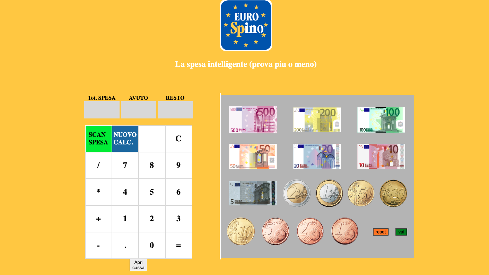

<!-- 
    https://img.shields.io/badge/npm-v10.5.0-blue?logo=npm
    Il badge che hai menzionato segue una struttura specifica definita da Shields.io per creare badge personalizzati con testo, colore e logo. Ecco una spiegazione dettagliata della struttura utilizzata per creare badge come quello per React e Vite:
    https://img.shields.io/badge/<label>-<message>-<color>?logo=<logo>
    Componenti del Badge:
Base URL:

https://img.shields.io/badge/
Label:
È il testo a sinistra del badge. Nel tuo esempio, react è il label.

Message:
È il testo a destra del badge. Nel tuo esempio, vite è il message.

Color:
È il colore di sfondo del badge. Nel tuo esempio, blue è il colore scelto.

Logo:
È il logo che appare a sinistra del badge. Nel tuo esempio, react è il logo che rappresenta React. Il parametro logo= è opzionale e può essere omesso se non si desidera un logo.

Esempio Spiegato:
Il tuo badge specifico per React e Vite ha la seguente struttura:

plaintext
Copia codice
https://img.shields.io/badge/react-vite-blue?logo=react
Label: react
Message: vite
Color: blue
Logo: react
Questo URL genera un badge con il testo "react" a sinistra, "vite" a destra, un colore di sfondo blu e il logo di React.
 -->
[](#contributors-)
[](https://it.wikipedia.org/wiki/JavaScript/)
[](https://www.paypal.com/paypalme/foferys)

## About


This application is a basic game emulator exercise using javascript.

In this emulator, you you can train at the cashier's job, learning to give change in the right way.

### Built With

This section should list any major technologies used in this project.

[](https://it.wikipedia.org/wiki/JavaScript/)
[](https://getbootstrap.com)

<p align="right">(<a href="#readme-top">back to top</a>)</p>


#### Developing
To begin developing, do this:

```bash
$ git@github.com:foferys/emulatore-cassa-Eurospino.git
```

<p align="right">(<a href="#-about">back to top</a>)</p>


## Contributors ✨ 
[](# "Contributors")

<!-- Thanks goes to these wonderful people -->

<!-- prettier-ignore-start -->
<!-- markdownlint-disable -->
<table>
  <tbody>
    <tr>
      <td align="center" valign="top" width="14.28%"><a href="https://github.com/gianpieroferraro"><br /><sub><b>Gianpiero Ferraro</b></sub></a><br />
      </td>
    </tr>
    <tr>
      <td align="center" valign="top" width="14.28%"><a href="https://github.com/foferys"><br /><sub><b>Foferys (Gianpiero Ferraro)</b>(always me lol)</sub></a><br />
      </td>
    </tr>
</tbody>
</table>


**Start coding!** 🎉


